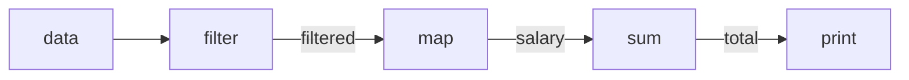

---
# Let's skip the definition!


---
## How do we represent our data..
---
# SQL
```sql
CREATE TABLE data (id number, name varchar, age number, salary number, dept varchar);

INSERT INTO data values 
(1,"Egon",50,1000,"Finance"),
(2,"Gilbert",50,2000,"Finance"),
(3,"Nova",37,1500,"HR"),
(4,"Ryan",78,1800,"HR"),
(5,"Gone",10,400,"Tech");
```
---

# Javascript

```javascript
var data = [
  {"id":1,"name":"Egon",   "age":50, "salary":1000, "dept":"Finance"},
  {"id":2,"name":"Gilbert","age":50, "salary":2000, "dept":"Finance"},
  {"id":3,"name":"Nova",   "age":37, "salary":1500, "dept":"HR"},
  {"id":4,"name":"Ryan",   "age":78, "salary":1800, "dept":"HR"},
  {"id":5,"name":"Gone",   "age":10, "salary":400,  "dept":"Tech"},
]
```
---

# Python

```python
from dataclasses import dataclass

@dataclass
class P:
    id: int
    name: str
    age: int
    salary: int
    dept: str

data = [
P(1,"Egon",50,1000,"Finance"),
P(2,"Gilbert",50,2000,"Finance"),
P(3,"Nova",37,1500,"HR"),
P(4,"Ryan",78,1800,"HR"),
P(5,"Gone",10,400,"Tech"),
]
```
---

## How to represent data
---

### Task01: show all your data

| Language | Code                      |
|----------|---------------------------|
| SQL      | ```SELECT * FROM data;``` |
| JS       | ```data```                |
| Python   | ```data```                |
---
# Let's try?
---
### Task02: Show each person name in data

| Language | Code                          |
|----------|-------------------------------|
| SQL      | ```SELECT name FROM data;```  |
| JS       | ```data.map(i => i.name)```   |
| Python   | ```[i.name for i in data]```  |
---
# Let's try?
---
# Sedikit penjelasan:

untuk JS: memakai konsep
- closure atau
- lambda atau
- pointer to function
- di mana function jadi sebuah variable

---

So:

```typescript
data.map(i => i.name)

// short of
data.map(function(i) {
    return i.name
})

// or maybe something like this
getname = function(i) {
    return i.name
}

data.map(getname)

// and it will be run like this.
var result = []
for (let i = 0; i < data.length; i++) {
    let item = getname(data[i])
    result.push(item)
}
result
```

---

Python menggunakan:
- ```[i.name for i in data]```
- Dinamain list comprehension
- Mengikuti Notasi matematika seprti $\{x | x \in A\}$
Contoh:

| Math                         | Python                      |
|------------------------------|-----------------------------|
| $A := \{1,2,3,4,5\}$         | ```a = [1,2,3,4,5]```       |
| $B := \{2.x \| x \in A \}$   | ```b = [2 * x for x in a]```|
| $B = \{2,4,6,8,10\}$         | ```b == [2,4,6,8,10]```     |
| $\{i_{name} \| i \in data\}$ | ```[i.name for i in data]```|
---
# Golang:
```go
func GetNames(pList []P) []String {
    names := make([]String, len(p))
    for i, p := range pList {
        names[i] = p.Name
    }
    return names
}
```
---

### Task03: Show names in above 40

| Language | Code                                               |
|----------|----------------------------------------------------|
| SQL      | ```SELECT name FROM data WHERE age > 40;```        |
| JS       | ```data.filter(i => i.age > 40).map(i => i.name)```|
| Python   | ```[i.name for i in data if i.age > 40]```         |

---
**SQL**
- Need explanation?

**Javascirpt**
``` javascript
var above40 = function(i) { return i.age > 40 }
data.filter(above40)
```

**Python**
$\{i_{name} | i \in D, i_{age} > 40\}$

```python
[i.name for i in data if i.age > 40]
```
---
# Golang:

```go
func GetNamesAbove40(pList []P) []String {
    names := make([]String, 0, len(p))
    for _, p := range pList {
        if p.Age > 40 {
            names = append(names, p.Name)
        }
    }
    return names
}
```
---

### Task04: Sum salary for people above 40

SQL
```sql
SELECT SUM(salary) FROM data WHERE age > 40
```
Javascript
```javascript
data
  .filter(i => i.age > 40)
  .map(i => i.salary)
  .reduce((t,i) => t + i, 0)
```
Python
```python
sum([i.salary for i in data if i.age > 40])
```

---
# Let's review the python first

```python
sum([i.salary for i in data if i.age > 40])

salaries = [i.salary for i in data if i.age > 40]
sum(salaries)
```
from this notation $\sum \{i_{salary} | i \in D, i_{age} > 40 \}$

---

# Javascript

In SQL
```sql
SELECT SUM(salary) FROM data WHERE age > 40
```
In JS:
```javascript
data
  .filter(where)  // age > 40 but in function
  .map(select)    // salary but in function
  .reduce(sum, 0) // reduce function 
```

Reducer is ``` (t,i) => t+i, 0 ``` quite hard to understand because 
```javascript
  .reduce( function (currentTotalSalary, salary) {
    return currentTotalSalary + salary
  }, 0)
```
---
# Javascript

```javascript
  .reduce( function (currentTotalSalary, salary) {
    return currentTotalSalary + salary
  }, 0)
```
suppose to be translate like
```javascript
var reducer = function (currentTotalSalary, salary) {
  return currentTotalSalary + salary
}

let totalSalary = 0
for (let i=0; i<data.length; i++) {
    let salary = data[i]
    totalSalary = reducer(totalSalary, salary)
}
totalSalary
```
---
# Golang

```go
func SumSalarayPeopleAbove40(pList []P) []String {
    totalSalary := 0
    for _, p := range pList {
        if p.Age > 40 {
            totalSalary += p.Salary
        }
    }
    return totalSalary
}
```

---
<style>
.col-2-wrap {
    width: 100%;
    height: 100%;
    display: flex;
    flex-direction: row; 
    gap: 10px;
}
.col-2 {
    flex: 1;
}
</style>
<div class="col-2-wrap">
<div class="col-2">

### Golang
```go
func SumSalarayOldPeople(pList []P) []String {
  totalSalary := 0
  for _, p := range pList {
    if p.Age > 40 {
      totalSalary += p.Salary
    }
  }
  return totalSalary
}
```
</div>

<div class="col-2">

### Javascript
```javascript
function sumSalarayOldPeople(data) {
  return data
      .filter(i => i.age > 40)
      .map(i => i.salary)
      .reduce((t,i) => t + i, 0)
}
```
</div>

</div>

---
<style>
.col-2-wrap {
    width: 100%;
    height: 100%;
    display: flex;
    flex-direction: row; 
    gap: 10px;
}
.col-2 {
    flex: 1;
}
</style>
<div class="col-2-wrap">
<div class="col-2">

### Golang simplified?
```go
func SumSalarayOldPeople(pList []P) []String {
  totalSalary := 0
  for _, p := range pList {
    if p.Age > 40 {
      totalSalary += p.Salary
    }
  }
  return totalSalary
}
```
</div>

<div class="col-2">

### Javascript simplified or obfuscated
```javascript
data.reduce((t, {age:a, salary:s}) => t+(a>40&&s), 0)
```

One line-ers :boom:
</div>
</div>

---

### Some Explanation Javascript

### Javascript simplified or obfuscated
```javascript
data.reduce((t, {age:a, salary:s}) => t+(a>40&&s), 0)

// short from
data.reduce(function (total, {age:a, salary:s}) {
  return t + (a>40&&s)
}, 0)

// a > 40 && s are short from
if (age > 40) {
  return salary
} else {
  return false || 0
}

```
---

# Let's see in another language.
- Kotlin
- Swift
- Rust

---
# Kotlin

```kotlin
data class P (
  val id: Long, 
  val name: String, 
  val age: Int,
  val salary: Double,
  val dept: String = "Tech",
)

fun main() {
  val p = listOf(
    P(1, "Egon", 50, 1000.0, "Finance"),
    P(2, "Gilbert", 50, 2000.0, "Finance"),
    P(3, "Nova", 37, 1500.0, "HR"),
    P(4, "Ryan", 78, 1800.0, "HR"),
    P(5, "Gone", 10, 400.0),
  )

  val result = p
    .filter { it.age > 40 }
    .map { it.salary }
    .sum()

  println(result)
}
```
---

# Swift

```swift
struct P {
  let id: Int
  let name: String
  let age: Int
  let salary: Double
  let dept: String
  
  init(id: Int, name: String, age: Int, salary: Double, dept: String = "Finance") {
    self.id = id
    self.name = name
    self.age = age
    self.salary = salary
    self.dept = dept
  }
}

let p = [
  P(id: 1, name: "Egon",    age: 50, salary: 1000.0),
  P(id: 2, name: "Gilbert", age: 50, salary: 2000.0),
  P(id: 3, name: "Nova",    age: 37, salary: 1500.0, dept: "HR"),
  P(id: 4, name: "Ryan",    age: 78, salary: 1800.0, dept: "HR"),
  P(id: 5, name: "Gone",    age: 10, salary: 400.0, dept: "Tech"),
]

let result = p
  .filter{ $0.age > 40}
  .map{ $0.salary }
  .reduce(0, +)

print(result)

```

---
# Rust
```rust
#[allow(dead_code)]
struct P {
    id: u64,
    name: String,
    age: u32,
    salary: i64,
    dept: String,
}

impl P {
    fn new(id: u64, name: &str, age: u32, salary: i64, dept: &str) -> Self {
        Self { id, name: name.to_string(), age, salary, dept: dept.to_string(), }
    }
}

fn main() {
    let data = vec![
        P::new(1, "Egon", 50, 1000, "Finance"),
        P::new(2, "Gilbert", 50, 2000, "Finance"),
        P::new(3, "Nova", 37, 1500, "HR"),
        P::new(4, "Ryan", 78, 1800, "HR"),
        P::new(5, "Gone", 10, 400, "Tech"),
    ];

    let result = data.iter()
        .filter(|p| p.age > 40)
        .map(|p| p.salary)
        .sum::<i64>();

    println!("Total salary: {}", result);
}

```
---
# Kotlin, Swift, Rust
<style>
.col-3-wrap {
    width: 100%;
    height: 100%;
    display: flex;
    flex-direction: row; 
    gap: 10px;
}
.col-3 {
    flex: 1;
}
</style>
<div class="col-3-wrap">
<div class="col-3">

Kotlin
```kotlin
val result = data
  .filter { it.age > 40 }
  .map { it.salary }
  .sum()
```
</div>

<div class="col-3">

Swift
```swift
let result = p
  .filter{ $0.age > 40}
  .map{ $0.salary }
  .reduce(0, +)
```

</div>

<div class="col-3">

Rust
```rust
let result = data.iter()
  .filter(|p| p.age > 40)
  .map(|p| p.salary)
  .sum::<i64>();
```

</div>
</div>

---
# How about in another programming language
---
# Haskell
```haskell
data P = P
  { id :: Int
  , name :: String
  , age :: Int
  , salary :: Int
  , dept :: String
  } deriving (Show)

peoples :: [P]
peoples =
  [ P 1 "Egon" 50 1000 "Finance"
  , P 2 "Gilbert" 50 2000 "Finance"
  , P 3 "Nova" 37 1500 "HR"
  , P 4 "Ryan" 78 1800 "HR"
  , P 5 "Gone" 10 400 "Tech"
  ]

main :: IO ()
main = do
  peoples 
  & filter (\person -> age person > 40) 
  & map salary 
  & sum 
  & print
```
---
# Elixir
```elixir
defmodule Person do
  defstruct id: 0, name: "", age: 0, salary: 0, dept: ""

  # Constructor function to create a new person
  def new(id, name, age, salary, dept) do
    %Person{id: id, name: name, age: age, salary: salary, dept: dept}
  end
end

data = [
  Person.new(1, "Egon", 50, 1000, "Finance"),
  Person.new(2, "Gilbert", 50, 2000, "Finance"),
  Person.new(3, "Nova", 37, 1500, "HR"),
  Person.new(4, "Ryan", 78, 1800, "HR"),
  Person.new(5, "Gone", 10, 400, "Tech"),
]

IO.puts "Total salary of people over 40 years old:"

data
|> Enum.filter(fn p -> p.age > 40 end)
|> Enum.map(fn p -> p.salary end)
|> Enum.reduce(0, fn s, acc -> s + acc end)
|> IO.puts
```
---
# Scala
```scala
case class Person(id: Int, name: String, age: Int, salary: Int, dept: String)

object Person {
  // Constructor function to create a new person
  def apply(id: Int, name: String, age: Int, salary: Int, dept: String): Person =
    new Person(id, name, age, salary, dept)
}

object Main extends App {
  val data = List(
    Person(1, "Egon", 50, 1000, "Finance"),
    Person(2, "Gilbert", 50, 2000, "Finance"),
    Person(3, "Nova", 37, 1500, "HR"),
    Person(4, "Ryan", 78, 1800, "HR"),
    Person(5, "Gone", 10, 400, "Tech")
  )

  println("Total salary of people over 40 years old:")

  val totalSalary = data
    .filter(p => p.age > 40)
    .map(p => p.salary)
    .sum

  println(totalSalary)
}
```
---

# Kotlin, Swift, Rust, Haskell, Elixir
<style>
.col-3-wrap {
    width: 100%;
    height: 100%;
    display: flex;
    flex-direction: row; 
    gap: 10px;
}
.col-3 {
    flex: 1;
}
</style>
<div class="col-3-wrap">
<div class="col-3">

Kotlin
```kotlin
val result = data
  .filter { it.age > 40 }
  .map { it.salary }
  .sum()
```

Haskell
```haskell
main = do
  peoples 
  & filter (\person -> age person > 40) 
  & map salary 
  & sum 
  & print
```
</div>

<div class="col-3">

Swift
```swift
let result = p
  .filter{ $0.age > 40}
  .map{ $0.salary }
  .reduce(0, +)
```

Elixir
```elixir
data
|> Enum.filter(fn p -> p.age > 40 end)
|> Enum.map(fn p -> p.salary end)
|> Enum.reduce(0, fn s, acc -> s + acc end)
|> IO.puts
```

</div>

<div class="col-3">

Rust
```rust
let result = data.iter()
  .filter(|p| p.age > 40)
  .map(|p| p.salary)
  .sum::<i64>();
```
Python
```python
d = filter(lambda p: p.age > 40, data)
d = map(lambda p: p.salary, d)
sum(d)
# The python is traitor
```
</div>
</div>

---
# Filter, Map, Reduce
- Is influenced by Pure Functional Programming
- For loop is not quite for. (for me: There is no for in Pure Programming)
- In Haskell, and Elixir data can be print imediatly.
---
# OOP vs Functional Programming

### Object Oriented Programming
- The function belongs to object named Collection / List / Vector / Array
- It is strange to put function `print` in that object

### Pure Functional
- The function just a function it receive the data and output the result



---
# Why not Golang

This is good. But why it doesn't exists, 
- because feature in language will be obsolte.
- filter, map, reduce in python is before list comprehension
- but mostly, because lack of Generic

---
# Some implementation in golang
```go
import "github.com/egon12/cols"

func sumSalaryOldPeople(data []P) int {
	data = cols.Filter(data, func(v P) bool { return v.Age > 40 })
	salary := cols.Map(data, func(v P) int { return v.Salary })
	return cols.Reduce(salary, func(a, b int) int { return a + b }, 0)
}
```
---

# No unreadable?

JS
```javascript
data
  .map(i => i.dept)
  .filter((v,i,a) => a.indexOf(v) == i)
```
Translate to this?

```sql
SELECT DISTINCT(dept) FROM data;
```

Or maybe better
```javascript
data
  .map(i => i.dept)
  .reduce((a,i) => a.add(i), new Set)
```

--- 

# Real Use Case

---

# KTP Scan

Kita ada program untuk scan KTP. Nah di KTP itu kita berupaya untuk mendapatkan data agama orang tersebut. Masalahnya, hasil OCR tidak selalu baik. Untungnya agama di KTP cuman ada 5. Walaupun bebas beragama, tapi cuman ada 5 agama.

Gimana cara meningkatkan akurasi data hasil OCR dengan 5 Agama?

----
## The Data we have
```kotlin
val agama = listOf(
    "Islam", 
    "Budha", 
    "Kristen", 
    "Katolik", 
    "Hindu",
)

val hasilOCR = listOf(
    "Islam", 
    "Islan", 
    "Buda", 
    "Kris", 
    "Ilam", 
    "Kristen",
)
```

--- 
## Word Distance (Levensthein Distance)

Ada sebuah function yang dinamain Levensthein Distance yang tujuannya melihat berapa jarak dari 2 buah kata.

Anggap saja kita namakan nama function-nya itu
```kotlin
fun levdist(a: String, b: String): Int { ... }
```
dan behaviour nya..
```kotlin
levdist("Islan","Islam")   // 1
levdist("Islan","Budha")   // 5 
levdist("Islan","Kristen") // 5
levdist("Islan","Hindu")   // 5
levdist("Islan","Katolik") // 6
```

---

## The algorithma

How do we do the Algorithm?
```kotlin
fun tebakAgama(input: String): Pair(String, Int) {
  return agama
    .map { Pair(it, levdist(input, it)) }
    .sortedBy { it.second }
    .first()
}

```
---

# Want try?

---

## Translate to SQL

```sql
SELECT nama, levdist(input, nama) FROM agama ORDER BY levdist(input, nama) LIMIT 1
```
---


---
# End, Thank you!!1
---

---
# Real End
---

# Creating SQL Database...

The main point of logic should be in here..
```javascript
data
  .filter(where)  // age > 40 but in function
  .map(select)    // salary but in function
  .reduce(agg_func, 0) // reduce function 
```

But some step:
- Parse into ast -> so we can divide and conquer..
- Create the High Order Function -> so we can store it in where, select and agg_func
- Run the code

---


---
# End, Thank you!!1
---

---
# Real End
---


---


```csv
id, name, age, salary, dept
1,"Egon",50,1000,Finance
2,"Gilbert",50,2000,Finance
3,"Nova",37,1500,HR
4,"Ryan",78,1800,HR
5,"Gone",10,400,Tech
```


```sql
SELECT SUM(salary) FROM mydata GROUP BY dept;
``` 

</td>

<td>

```javascript
mydata.reduce(
    (a, {dept:d, salary:s}) => ({
        ...a, 
        [d]: a[d] || 0 + s }),
    {})
```

</td>

<td>

```python3
{ d: sum(
    [i.salary for i in mydata if i.dept == d]
) for d in set([i.dept for i in mydata]) }

# Cheating
import pandas
padans.DataFrame(mydata).groupby('dept').sum()
```
</td>
</tr>


</table>


## Golang?

```go
type P struct {
    Id int64
    Name string
    Age int32
    Salary float64
}

l := []P {
    {1,"Egon",50,1000},
    {2,"Gilbert",50,2000},
    {3,"Nova",37,1500},
    {4,"Ryan",78,1800},
    {5,"Gone",10,400},
}
```

Filter age above 40 (using immutable concept)
```go
func filterAbove40(l []P) []P {
    res := make([]P, len(l))
    for i, p := range l {
        if p.age > 40 {
            res = append(res, p)
        }
    }
    return res
}
```

Sum salary if P.age above 40

```go
func sumSalaryAbove(l []P) float64 {
    sumSalary := 0
    for _, p := range l {
        if l.age > 40 {
            sumSalary += l.Salary
        }
    }
    return sumSalary
}
```


